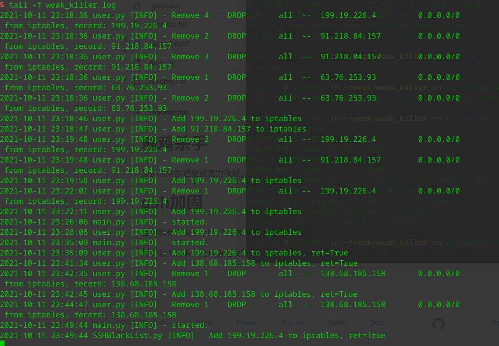

# 弱鸡杀手

保护服务器避免被暴力攻破。

# SSH加固

当判断有人通过ssh登录非本地账户时（暴力撞库），则将该IP加入到防火墙黑名单中。

为了防止误杀，允许指定次数，低于指定次数会在一定时间后解锁。超过次数自动永久封禁。

## 配置文件

`/var/weak_killer/ssh_black_list.json`

## 日志

`/var/log/weak_killer/weak_killer.log`

